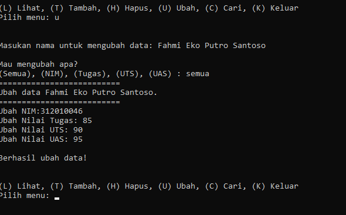
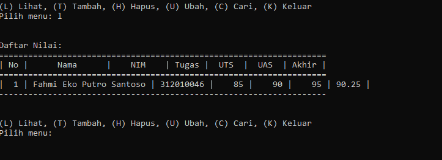
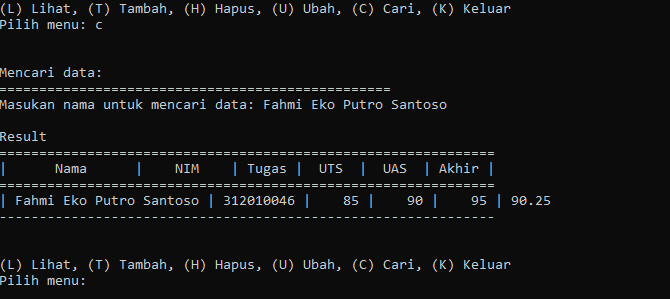
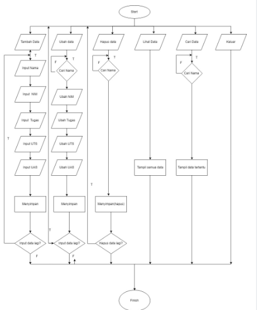

# UAS Bahasa Pemrograman

- Nama  : Fahmi Eko Putro Santoso
- NIM   : 312010046
- Kelas : TI.20.A1

**Struktur Package & Module**


**Penjelasan:**

**Model**

daftar_nilai

*-tambah data*
* ``data = {}`` untuk menampung list data yang nanti akan terinput
* deklarasikan fungsi ``def tambah_data():``
* ``nama = input("Masukan nama: ")`` lalu tambahkan input nama, nim, nilai tugas, uts, uas
* ``nilai_akhir = (nilai_tugas)*30/100 + (nilai_uts)*35/100 + (nilai_uas)*35/100 `` untuk nilai akhir diambil dari perhitungan 3 komponen nilai (nilai_tugas: 30%, nilai_uts: 35%, nilai_uas: 35%)
* ``data[nama] = [nama, nim, nilai_tugas, nilai_uts, nilai_uas, nilai_akhir]`` kita akan masukkan data yang tadi kita input ke dalam `data[nama]'
* lalu cetak ``print()``

*-Ubah data*
* deklarasikan fungsi ``def ubah_data():``
* ``nama = input("Masukan nama untuk mengubah data: ")`` kita akan menginput data yang nanti akan di ubah
* ``if nama in data.keys(): print("Mau mengubah apa?")`` jika 'nama' dari di dalam 'data' maka akan mengembalikan daftar menggunakan fungsi 'keys()' lalu di cetak lah 'print()'
* ``sub_data = input("(Semua), (Nama), (NIM), (Tugas), (UTS), (UAS) : ")`` membuat menu ubah di dalam ``sub_data``
* ``if sub_data.lower() == "semua":`` ambil kata kunci 'semua' di dalam ``sub_data`` jika 'semua' maka input ``data[nama][1] = input("Ubah NIM:") data[nama][2] = int(input("Ubah Nilai Tugas: ")) data[nama][3] = int(input("Ubah Nilai UTS: ")) data[nama][4] = int(input("Ubah Nilai UAS: "))``
* ``data[nama][5] = data[nama][2] *30/100 + data[nama][3]*35/100 + data[nama][4] *35/100 `` kita dapatkan nilai akhir dengan diambil dari perhitungan 3 komponen nilai (tugas: 30%, uts: 35%, uas: 35%),
**ket: [5] = nilai_akhir, dimana [0] = nama**

* lalu cetak ``print("\nBerhasil ubah data!")``
* Jika kita ingin mengubah data tertentu maka ``elif sub_data.lower() == "nim": data[nama][1] = input("NIM:")`` dan berlaku juga untuk nilai tugas, UTS dan UAS
* lalu cetak ``print("\nBerhasil ubah data!")``
* ``else: print("'{}' tidak ditemukan.".format(nama))`` jika kita salah dalam memasukkan nama untuk mengubah data maka akan muncul 'nama tidak di temukan'

*-Cari data*
* deklarasikan fungsi ``def cari_data():``
* ``nama = input("Masukan nama untuk mencari data: ")`` kita akan menginput data yang nanti akan di cari
* ``if nama in data.keys():`` kita mengambil list 'nama' di dalam 'data' menggunakan pengkondisian
* maka cetak ``print("Nama: {0}\nNIM : {1}\nNilai Tugas: {2}\nUTS: {3}\nUAS: {4}\nNilai akhir: {5}"`` untuk menampilkan data yang tersedia
* ``else: print("'{}' tidak ditemukan.".format(nama))`` jika data yang kita input salah/tidak ditemukan maka akan tercetak 'nama tidak di temukan'

*-Hapus data*
* deklarasikan fungsi ``def hapus_data():``
* ``nama = input("Masukan nama untuk menghapus data : ")`` kita akan menginput data yang nanti akan di hapus
* ``if nama in data.keys():`` kita mengambil list 'nama' di dalam 'data' menggunakan pengkondisian
* ``del data[nama]`` hapus semua 'nama'  yang ada di dalam 'data'
* jika sudah maka cetak ``print("sub_data '{}' berhasil dihapus.".format(nama))``
* ``else: print("'{}' tidak ditemukan.".format(nama))`` jika data yang kita input salah/tidak ditemukan maka akan tercetak 'nama tidak di temukan'

**View**

input_nilai
* menambahkan fungsi input yang nanti nya akan di deklarasikan di setiap module nya, ``def input_nama():`` ``def input_nim():`` dan yg lainnya, yang nanti akan di masukkan kedalam ``data={}``

view_nilai
* deklarasikan fungsi ``def lihat_data():`` Kita menggunakan kondisi percabangan if, ambil data dari ``data``
* lalu cetak ``print()``


Lalu yang terakhir kita eksekusi file main.py
```
from model.daftar_nilai import *
from view.view_nilai import *

#Mulai
print("===============================================================")
print("|                           Program 1                         |")
print("===============================================================")

while True:
    print("\n")
    menu = input("(L) Lihat, (T) Tambah, (H) Hapus, (U) Ubah, (C) Cari, (K) Keluar\nPilih menu: ")
    print("\n")

    # menu
    if menu.lower() == 't':
        tambah_data()

    elif menu.lower() == 'c':
        cari_data()

    elif menu.lower() == 'l':
        lihat_data()

    elif menu.lower() == 'u':
        ubah_data()

    elif menu.lower() == 'h':
        hapus_data()

    # Keluar
    elif menu.lower() == 'k':
        break

    else:
        print("Upss ada yang salah, silahkan cek kembali.")

```

**Output:**

Tambah data


Ubah data




Lihat data




Cari data




Hapus data


**Flowchart:**



